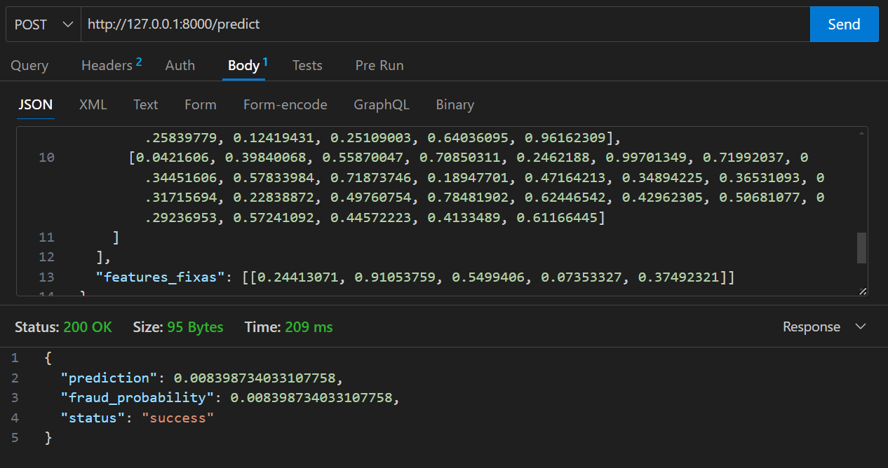

# Modelo de Detecção de Fraudes

Este projeto implementa um modelo de detecção de fraudes usando features temporais e fixas, disponibilizado através de uma API REST usando FastAPI. O objetivo é prever se pode haver fraude no trimestre seguinte.
## Instalação

1. Clone o repositório:
```bash
git clone https://github.com/Inteli-College/2024-2A-T04-SI11-G04.git
cd src/backend
```

2. Crie um ambiente virtual e instale as dependências:
```bash
python -m venv venv
source venv/bin/activate  # Linux/Mac
# ou
.\venv\Scripts\activate  # Windows
pip install -r requirements.txt
```

## Estrutura do Projeto

```
backend/
│
├── main.py              # Código principal da API
├── requirements.txt     # Dependências do projeto
├──modelo_fraude.h5      # Modelo Serializado
└── README.md           # Este arquivo
```

## Uso da API

### Iniciar o servidor

```bash
uvicorn main:app --reload
```

A API estará disponível em `http://localhost:8000`

### Documentação da API

Acesse a documentação interativa em:
- Swagger UI: `http://localhost:8000/docs`
- ReDoc: `http://localhost:8000/redoc`

### Exemplo de Requisição

```python
import requests
import numpy as np

# Preparar dados de exemplo
features_temporais = np.random.rand(1, 7, 26)  # 1 amostra, 7 timesteps, 26 features
features_fixas = np.random.rand(1, 5) # 1 amostra, 5 features fixas

# Fazer requisição
response = requests.post(
    "http://localhost:8000/predict",
    json={
        "features_temporais": features_temporais,
        "features_fixas": features_fixas
    }
)

print(response.json())
```
ou usar o **Thunder Client**


## Formato dos Inputs

### Features Temporais
- Shape: `(1, 7, 26)`
- Representam 7 timesteps com 26 features cada
- Inclui médias e desvios padrão de:
  - Consumo
  - Indicadores econômicos (SELIC, IGPM, IPCA)
  - Dados meteorológicos
  - Eventos (shows, feriados, etc.)

### Features Fixas
- Shape: `(1, 5)`
- Inclui:
  - Categoria do local
  - Encoding cíclico de latitude e longitude

## Dependências

```
fastapi==0.104.1
uvicorn==0.24.0
tensorflow==2.15.0
pydantic==2.4.2
python-multipart==0.0.6
typing-extensions>=4.8.0
```